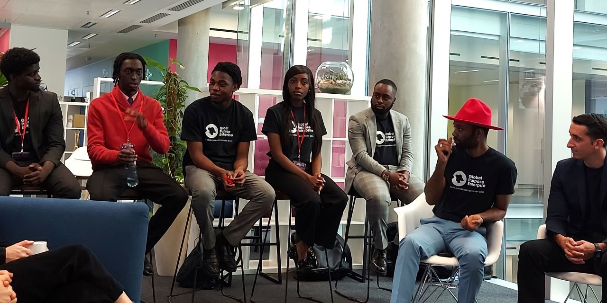

I’m currently a data science MSc student at the University of Leeds and an incoming intern at the Alan Turing Institute. My work spans software engineering, machine learning and data science in industries such as finance and social impact


    Latest Resume


---

## Education

**MSc Data Science (Statistics)**  
*University of Leeds (2025 – 2027)*

Core modules: Statistical Computing, Machine Learning, Bayesian Statistics, Multivariate Methods

**BSc Computing**  
*Queen Mary University of London (2021–2024)*  

Core Modules: Neural Networks and Deep Learning, Further Object Oriented Programming, Algorithms and Data Structures

Dissertation: CashFlo, enhancing personal finance through Open Banking and an AI chatbot

---

## Industry Experience

**Incoming Data Science Intern — Alan Turing Institute**  
*June 2025 – August 2025*  
Selected for the Health Data Science Black Internship Programme

Will work on developing new models and submodels in the Turing.jl (Julia) library, ensuring that different models can be composed together to form a larger model

**Junior Software Engineer — Global Purpose Enterprise**  
*May 2024 – Nov 2024*  
Participated in the engineering of a 12-minute video call mentorship platform using React Native and Firebase earning numerous corporate sponsorships in the process

Implemented key features such as "Tinder" like swiping for selection, admin-level profile validation and an algorithmic matching system for mentor-mentee pairing improving overall user experience

Developed an admin panel using Tailwind, React and Node.js enabling the access of data insights, analytics and feedback for the mentorship calls from the app

**Software Engineer Intern — J.P. Morgan**  
*June 2023 – August 2023*  

Collaborated with cross-functional teams to design and prototype a FIX RFQ (time-series) message handler
successfully replacing the previous system and improving trading efficiency and request processing

Presented the project proposal to the global team, demonstrating strong communication skills to ensure alignment across team members.

Spearheaded the development of an improved manual submission system for prices by processing submissions
from SharePoint, enhancing data accuracy and streamlining workflows for improved efficiency.

Gained experience in large-scale systems and financial technologies

---

## Technical Projects

**Synthetic Voice Translation for Low-Resource Languages**

* Engineered a full speech translation system designed to generate synthetic voices for underrepresented languages
* Fine-tuned the VITS Lingala OpenBible model on Lingala Read Speech Corpus to improve pronunciation and speech clarity
* Built a modular pipeline integrating Speech-to-Text, Machine Translation and Text-to-Speech systems
* Allows speakers of low-resource languages to watch any video that was initially created in English, in their own language
* Presented findings at Tech Show London's Big Data & AI World 2025 

**Automatic Speech Recognition for Low-Resource Languages**  

* Developed a automatic speech recognition (ASR) model for Lingala using the XLSR-53 architecture
* Achieved a WER of 0.21 after fine-tuning on the Lingala Read Speech Corpus
* Preprocessed raw audio by standardising sampling rates, creating vocabulary files and aligning transcriptions
* Implemented custom data collators for dynamic padding and efficient batch training
* Presented the system at the UKBlackTech Christmas Social, highlighting its potential for inclusive voice technology

**Sickle Cell CNN Classifier**  

* Designed and trained a convolutional neural network (CNN) using PyTorch to classify sickle cell disease from blood smear images collected from the Teso region in Eastern Uganda
* Reached 97.65% validation accuracy and 95.51% test accuracy
* Tackled class imbalance with weighted loss functions and performed PCA to analyse feature separability
* Findings from this project were cited in An Image-based Sickle Cell Detection Method [(TechRxiv)](https://www.techrxiv.org/doi/full/10.36227/techrxiv.173161086.63114554/v1) for contributions to the methodology and dataset application

---

## Speaking & Public Engagement

- **Big Data & AI World London (2025):** Speaker — *Synthetic Voice Translation for Low-Resource Languages*
- **Big Data & AI World London (2025):** Panelist — *How Data Models Can Drive Better Decisions for Local Communities*
- **UKBlackTech Christmas Social (2024):** Speaker — *Automatic Speech Recognition for Low-Resource Languages*
- **Global Purpose Enterprise Career Mentorship Conference (2023)** Panelist - *How to Secure Your Internship*
- **Global Purpose Enterprise Career Mentorship Conference (2023)** Presenter - *How to Build Your Network*

Topics I regularly speak on include: ethical machine learning, AI for social good, career and professional development advice

---

## Skills & Tools

**Programming:** Python, SQL, R, Java, JavaScript, HTML, CSS

**ML & Data:** PyTorch, Scikit-learn, HuggingFace, Pandas, NumPy, Matplotlib  

**Frameworks:** FastAPI, Firebase, React, Node.js, Tailwind, React Native, Hugo, Streamlit 

**DevOps & Tools:** Git, Tableau, Postman, Github Actions

**Cloud:** AWS

---

## Interests

- AI for social good
- Data-decision making
- Responsible AI
- Open-source speech tools and low-resource NLP
- Human-centered machine learning
- Community mentoring and public speaking
- Chelsea FC 🔵

---
## Gallery


  
  
  
  
  
  
  
  
  


---

## Contact

Want to chat? Drop me an [email](mailto:mail@mosesmakola.com), dm me on [Linkedin](https://linkedin.com/in/moses-makola) or book a [meeting](https://calendly.com/moses-makola/30min)

